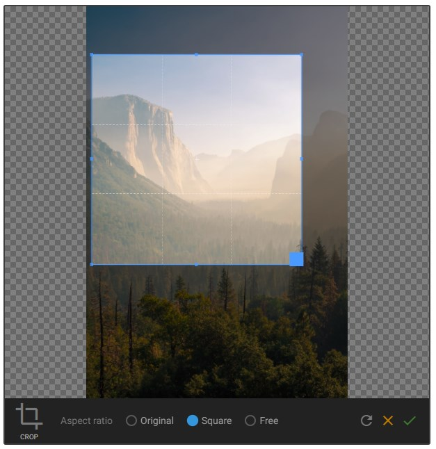

# Gentics UI Image Editor

An Angular module for cropping, resizing and setting the focal point of images.



## Installation

Install from npm:

```bash
$ npm install gentics-ui-image-editor --save
```

and import the `GenticsUIImageEditorModule` into your Angular app. Note that this module depends on [Gentics UI Core](https://github.com/gentics/gentics-ui-core) v6.1.0 or above.

```TypeScript
import { BrowserModule } from '@angular/platform-browser';
import { NgModule } from '@angular/core';
import { GenticsUICoreModule } from 'gentics-ui-core';
import { GenticsUIImageEditorModule } from 'gentics-ui-image-editor';

import { AppComponent } from './app.component';

@NgModule({
  declarations: [
    AppComponent
  ],
  imports: [
    BrowserModule,
    GenticsUICoreModule.forRoot(),
    GenticsUIImageEditorModule
  ],
  providers: [],
  bootstrap: [AppComponent]
})
export class AppModule { }
```

## API

```HTML
<gentics-ui-image-editor [src]="sourceUrl"
                         [canCrop]="canCrop"
                         [canResize]="canResize"
                         [canSetFocalPoint]="canSetFocalPoint"
                         [language]="language"
                         (transform)="transformParams = $event"></gentics-ui-image-editor>
```

### Inputs

* **`src`** [`string`] **required** The url of the image to be edited.
* **`canCrop`** [`boolean`] Enables the crop functionality. Defaults to `true`.
* **`canResize`** [`boolean`] Enables the resize functionality. Defaults to `true`.
* **`canSetFocalPoint`** [`boolean`] Enables the focal point functionality. Defaults to `true`.
* **`language`** [`'en' | 'de'`] Specifies the language for labels used in the editor. Defauls to `'en'`.

### Outputs

* **`transform`** [`ImageTransformParams`] Emits whenever a transformation is applied to the image. The `ImageTransformParams` type is given below.

```TypeScript
type ImageTransformParams = {
    width: number;
    height: number;
    scaleX: number;
    scaleY: number;
    cropRect: {
        startX: number;
        startY: number;
        width: number;
        height: number;
    };
    focalPointX: number;
    focalPointY: number;
};
```

This module does not modify the source image in any way. It simply returns the above parameters which can then be used to process the image. This is typically done using an image manipulation API such as that offered by [Gentics Mesh](https://getmesh.io/docs/beta/features.html#imagemanipulation).

## Development

1. Clone this repo
2. `$ npm install`
3. `$ npm run playground`
4. Once the initial build has completed, open `http://localhost:3000/` in a browser.

The Playground app demonstrates each of the functions of the image editor and is the suggested way to develop new features or bug fixes.

### Testing
```bash
$ npm run test
```

### Linting
```bash
$ npm run lint
```

### Building for Production
To generate all `*.js`, `*.d.ts` and `*.metadata.json` files:

```bash
$ npm run build
```

These will be placed in the `/dist` directory, which contains all elements required for the npm package.
